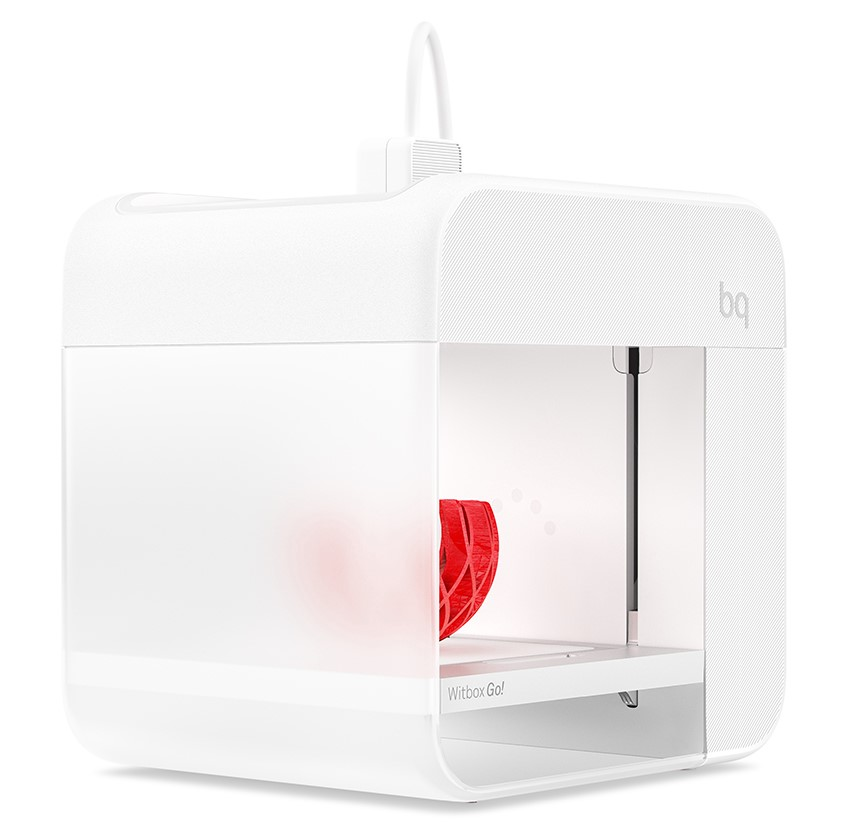

# Witbox Go!

This repository contains the source files for the Witbox Go! 3D printer (https://www.bq.com/es/witbox-go)

Witbox Go! is BQ’s vision of the future of 3D printing. The first ever 3D printer powered by Android.
The Witbox Go! is a product designed for a wide spectrum of consumers, not only for users with a technical background. A great product focused on getting amazing results (printed parts!), not on the 3D printing technology or the machine itself. Our aim is to bring 3D printing to the general public by making the process easy, fun, and affordable.

All files in this repository are released under the [Creative Commons Attribution-ShareAlike 4.0 International License](http://creativecommons.org/licenses/by-sa/4.0/).

